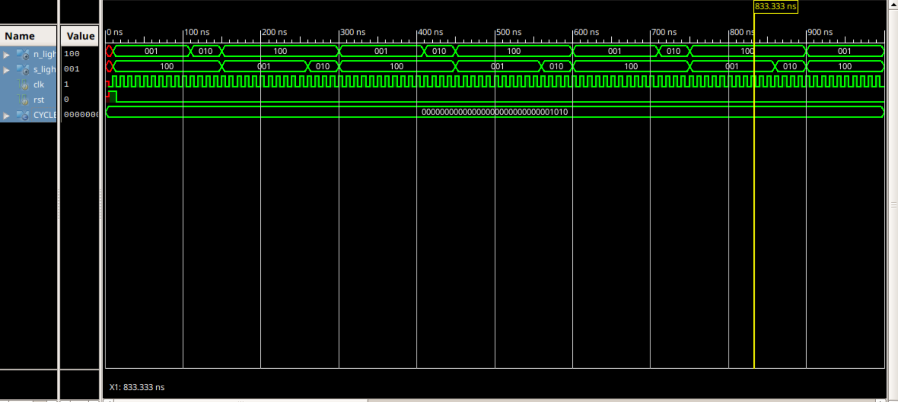

# 2-Way Traffic Light Controller (Verilog)

## 📌 Project Overview
This project implements a **2-way traffic light controller** in Verilog HDL.  
The design is written in RTL (`traffic.v`) and tested using a Verilog testbench (`traffic_tb.v`).  
The functionality is verified through simulation in **ISim** (Xilinx ISE).

## 📂 Repository Contents
- `traffic.v` → RTL design file for the traffic light controller  
- `traffic_tb.v` → Testbench used for verifying the RTL design  
- `docs/waveform.png` → Simulation waveform image (to be added)  
- `README.md` → Project documentation  

## ⚙️ Functionality
- Controls two sets of traffic lights (for two roads at an intersection).  
- Uses an FSM-based approach with states for **Green, Yellow, and Red** signals.  
- Clock-driven design with reset functionality.  
- Ensures safe signal transition between both directions.

## 🧪 Simulation
- The design is simulated using **ISim**.  
- Testbench applies clock and reset signals to drive the FSM.  
- Output signals for both roads are observed in the waveform.  

### ✅ Waveform Result
Simulation waveform will be shown here after adding the PNG file:

## 🚀 How to Run
1. Open **Xilinx ISE** or any Verilog simulator.  
2. Add both `traffic.v` and `traffic_tb.v` to the project.  
3. Run behavioral simulation.  
4. Observe traffic light sequence in the waveform.  

## 📜 License
This project is open-source under the MIT License.  
You are free to use, modify, and distribute it for educational purposes.

